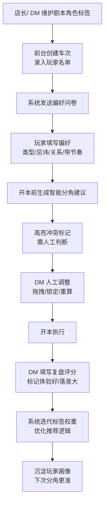

# 剧本杀分角排班后台 - 产品需求文档 (PRD)

## 1. 产品概述

面向剧本杀工作室店长的 Web 排班式分角管理后台，解决一天多场、多 DM 同时开本场景下的角色分配效率与体验优化问题。通过剧本角色标签化管理、玩家偏好收集、智能分角推荐和复盘反馈闭环，持续提升玩家体验和门店运营效率。

- **核心目标**：将 DM 凭经验分角的传统方式升级为数据驱动的智能分角系统
- **目标用户**：剧本杀门店店长、资深 DM、前台运营人员
- **市场价值**：降低新人 DM 分角门槛，减少角色错配导致的差评，沉淀门店运营数据资产

---

## 2. 核心功能

### 2.1 用户角色

| 角色 | 登录方式 | 核心权限 |
|------|----------|----------|
| 店长 | 账号密码登录 | 全部权限：剧本/角色管理、车次排班、查看全部分角记录、调整推荐权重 |
| DM | 账号密码登录 | 查看负责车次、填写分角复盘、查看历史分角建议 |
| 前台 | 账号密码登录 | 车次预约管理、发送偏好问卷、录入玩家信息 |

### 2.2 功能模块

1. **剧本角色库**：剧本 CRUD、角色标签体系（难度/性别/情感/推理/新手友好）、批量导入、角色关系图配置
2. **预约车次**：日历排班视图、车次 CRUD、DM 分配、玩家名单录入、偏好问卷发送与回收
3. **分角复盘**：智能分角建议引擎、人工调整界面、冲突标记高亮、分角评分、体验反馈记录、标签权重迭代

### 2.3 页面详情

| 页面名称 | 模块名称 | 功能描述 |
|----------|----------|----------|
| 控制台仪表盘 | 数据概览卡片 | 今日车次、在开本数、待分角数、本周分角满意度趋势 |
| 控制台仪表盘 | 今日车次时间轴 | 按时间线展示今日所有车次状态（待开本/进行中/已结束） |
| 剧本列表页 | 剧本筛选与搜索 | 按题材/人数/难度/时长筛选，支持名称模糊搜索 |
| 剧本列表页 | 剧本卡片列表 | 展示封面、名称、题材、人数、难度、评分，支持快捷编辑 |
| 剧本编辑页 | 基本信息表单 | 剧本名称、封面图、题材、人数、时长、难度、简介 |
| 剧本编辑页 | 角色标签管理 | 角色卡片网格，每个角色配置：姓名、头像、性别限制、难度等级、情感浓度、推理参与度、新手友好度、角色标签 |
| 剧本编辑页 | 角色关系配置 | 可视化配置角色间关系（情侣/对立/亲属/保密等），用于分角冲突检测 |
| 车次排班页 | 周/日视图切换 | 日历式排班视图，按房间和时间段展示车次，支持拖拽调整 |
| 车次排班页 | 车次创建弹窗 | 选择剧本、日期时间、房间、DM、添加玩家名单 |
| 车次详情页 | 玩家信息面板 | 玩家列表，每人展示历史场次、偏好画像、熟人关系标注 |
| 车次详情页 | 偏好问卷管理 | 一键生成问卷链接、查看回收状态、展示每个玩家的偏好回答 |
| 分角建议页 | 智能匹配结果表 | 行=玩家，列=角色，展示匹配分数，系统推荐方案高亮 |
| 分角建议页 | 冲突警告标记 | 红色高亮需人工判断的分配：情侣拿对立角色、社恐拿主持位、新手拿高难角色 |
| 分角建议页 | 人工调整操作 | 拖拽交换角色、锁定满意分配、重新生成建议 |
| 分角复盘页 | 分角评分面板 | 整体满意度打分（1-5星），选择「体验最佳」和「落差较大」的玩家 |
| 分角复盘页 | 体验标签反馈 | 每个玩家-角色对勾选体验标签（沉浸/感动/烧脑/无聊/懵/意难平等） |
| 分角复盘页 | 标签优化建议 | 基于本次反馈，系统自动给出建议调整的角色标签 |
| 历史记录页 | 分角历史列表 | 按时间倒序展示所有车次分角记录，可筛选剧本/DM |
| 历史记录页 | 分角详情回放 | 查看某次分角的原始建议、人工调整记录、最终评分 |

---

## 3. 核心流程

### 主流程描述

店长/DM 先在角色库维护剧本和角色标签 → 前台创建车次并录入玩家 → 系统发送偏好问卷给玩家 → 玩家填写偏好后，开本前系统生成智能分角建议 → DM 根据建议和经验人工调整 → 开本结束后 DM 填写复盘评分 → 系统根据反馈迭代标签权重和推荐算法。

---

## 4. 用户界面设计

### 4.1 设计风格

- **主色调**：深邃墨紫色 `#4B2E7A`（神秘悬疑感）+ 琥珀金 `#D4A84B`（质感点缀）
- **辅助色**：暗红 `#8B2635`（冲突警告）、薄荷绿 `#3DA35D`（匹配成功）、暖橙 `#E8873A`（人工提醒）
- **背景色**：深夜灰 `#1A1620`（主背景）、烟紫灰 `#251E30`（卡片背景）
- **字体选择**：
  - 标题/展示：Noto Serif SC（衬线体，增添剧本杀文学质感）
  - 正文/数据：PingFang SC / Microsoft YaHei（清晰易读）
  - 数字/标签：JetBrains Mono（等宽数字，对齐美观）
- **按钮风格**：微圆角（6px），悬停时上浮 2px + 柔化阴影，主按钮带琥珀金渐变描边
- **布局风格**：左侧固定导航 + 右侧内容区，卡片式模块，深色毛玻璃质感
- **图标风格**：线性图标（Lucide），悬疑主题自定义图标（面具、放大镜、线索卡、舞台幕布）
- **质感细节**：细金边框装饰标题区、卡片内微弱噪点纹理、重要数据用琥珀金高亮

### 4.2 页面设计概览

| 页面名称 | 模块名称 | UI 元素 |
|----------|----------|----------|
| 控制台仪表盘 | 数据概览卡片 | 深色毛玻璃卡片 + 琥珀金数据 + 迷你趋势图 + 悬停微弹动 |
| 控制台仪表盘 | 今日车次时间轴 | 左侧金线时间轴 + 右侧车次卡片 + 状态色块标签 |
| 剧本列表页 | 剧本卡片网格 | 不规则瀑布流 + 悬停放大封面 + 底部标签栏 |
| 剧本编辑页 | 角色卡片 | 六边形角色头像框 + 五色雷达图（难度/情感/推理等） + 标签徽章 |
| 车次排班页 | 日历视图 | 时间轴网格 + 房间列 + 车次色块 + 拖拽阴影动画 |
| 分角建议页 | 匹配矩阵 | 热力图色块（绿→黄→红） + 冲突红色发光边框 + 锁定图标 |
| 分角复盘页 | 评分面板 | 五星动态交互 + 玩家头像浮动标签 + 体验标签云 |

### 4.3 响应式

- **设计优先级**：Desktop-first，主要面向门店后台大屏（1440px+）操作
- **平板适配**：≥1024px 时左侧导航折叠为图标栏，内容区全宽
- **移动端**：≥768px 时顶部导航抽屉式展开，卡片单列堆叠
- **触控优化**：按钮最小 44px 触控区域，拖拽操作支持触摸手势

---
