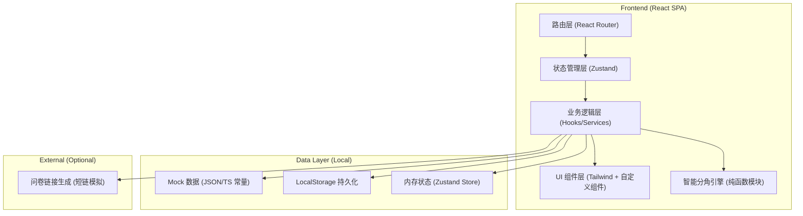
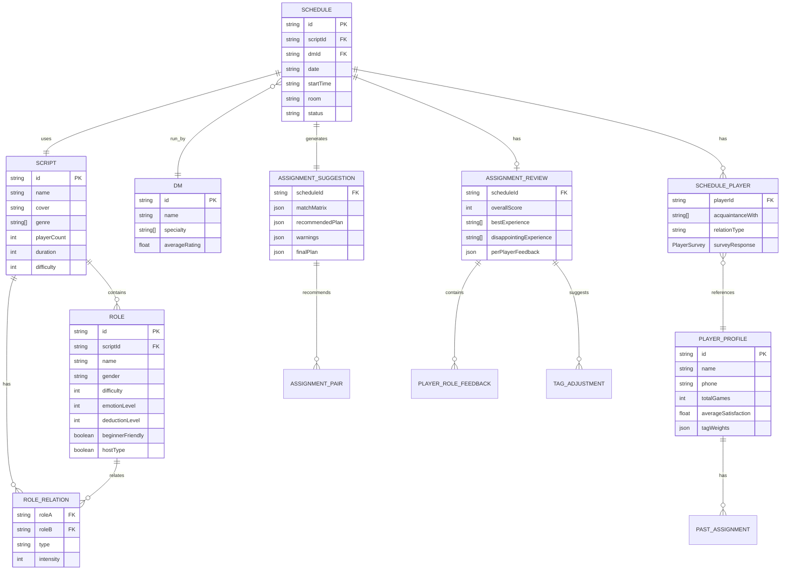

# 剧本杀分角排班后台 - 技术架构文档

## 1. 架构设计



---

## 2. 技术选型说明

| 层级 | 技术 | 版本 | 选型理由 |
|------|------|------|----------|
| 前端框架 | React | 18.2+ | 组件化开发，生态成熟，适合复杂交互后台 |
| 开发构建 | Vite | 5.0+ | 极速冷启动，HMR 快，配置简洁 |
| 语言 | TypeScript | 5.0+ | 强类型保障复杂数据结构（角色标签、匹配矩阵）的正确性 |
| 样式方案 | Tailwind CSS | 3.4+ | 原子化 CSS，快速构建深色质感界面，减少样式体积 |
| 图标库 | Lucide React | 0.300+ | 线性风格统一，支持按需 tree-shaking |
| 状态管理 | Zustand | 4.4+ | 轻量无模板代码，适合中后台多模块状态隔离 |
| 路由 | React Router DOM | 6.20+ | 嵌套路由 + 动态参数，满足车次/剧本详情页需求 |
| 数据可视化 | Recharts | 2.10+ | 轻量 React 图表库，用于满意度趋势和雷达图 |
| 拖拽交互 | @dnd-kit/core | 6.1+ | 无障碍拖拽，用于分角页面的角色拖拽交换 |
| 日期处理 | date-fns | 3.0+ | 轻量函数式日期库，处理车次排班时间计算 |

---

## 3. 路由定义

| 路由路径 | 页面名称 | 用途 |
|----------|----------|------|
| `/dashboard` | 控制台仪表盘 | 数据概览 + 今日车次时间轴 |
| `/scripts` | 剧本列表页 | 剧本浏览、搜索、筛选、快捷操作 |
| `/scripts/:id/edit` | 剧本编辑页 | 剧本信息 + 角色标签 + 角色关系配置 |
| `/schedules` | 车次排班页 | 日历排班视图、车次创建与管理 |
| `/schedules/:id` | 车次详情页 | 玩家信息 + 偏好问卷回收状态 |
| `/schedules/:id/assign` | 分角建议页 | 智能匹配矩阵 + 人工调整 + 冲突警告 |
| `/schedules/:id/review` | 分角复盘页 | 满意度评分 + 体验标签反馈 |
| `/history` | 历史记录页 | 分角历史列表 + 详情回放 |
| `/players` | 玩家管理页 | 玩家画像库 + 历史偏好记录 |

---

## 4. 核心数据模型 (TypeScript 类型定义)

```typescript
// ========== 剧本角色库 ==========
interface Script {
  id: string;
  name: string;
  cover: string;
  genre: string[];        // 题材：恐怖/情感/硬核/欢乐/阵营/本格/变格
  playerCount: number;    // 人数
  duration: number;       // 时长（分钟）
  difficulty: 1 | 2 | 3 | 4 | 5; // 整体难度
  description: string;
  roles: Role[];
  relations: RoleRelation[];
  createdAt: string;
}

interface Role {
  id: string;
  scriptId: string;
  name: string;
  avatar: string;
  gender: 'male' | 'female' | 'any';  // 性别限制
  difficulty: 1 | 2 | 3 | 4 | 5;      // 角色难度
  emotionLevel: 1 | 2 | 3 | 4 | 5;    // 情感浓度
  deductionLevel: 1 | 2 | 3 | 4 | 5;  // 推理参与度
  beginnerFriendly: boolean;          // 新手友好
  hostType: boolean;                  // 是否主持型/信息位角色
  tags: string[];                     // 自定义标签：高冷/隐忍/白切黑等
  description: string;
}

interface RoleRelation {
  roleA: string;
  roleB: string;
  type: 'lover' | 'enemy' | 'family' | 'partner' | 'secret';
  intensity: 1 | 2 | 3;  // 关系强度
}

// ========== 预约车次 ==========
interface Schedule {
  id: string;
  scriptId: string;
  date: string;             // YYYY-MM-DD
  startTime: string;        // HH:mm
  endTime: string;
  room: string;             // 房间号
  dmId: string;
  status: 'pending' | 'ready' | 'playing' | 'finished' | 'cancelled';
  players: SchedulePlayer[];
  surveyStatus: 'not_sent' | 'sent' | 'partial' | 'completed';
  createdAt: string;
}

interface SchedulePlayer {
  playerId: string;
  isNew: boolean;           // 是否新客
  acquaintanceWith: string[]; // 同行熟人ID列表
  relationType?: 'lover' | 'friend' | 'family' | 'colleague' | 'stranger';
  surveyResponse?: PlayerSurvey;
  finalRoleId?: string;
}

interface PlayerSurvey {
  submittedAt: string;
  preferredGenres: string[];   // 想玩的类型
  tabooContent: string[];      // 忌讳内容：恐怖/血腥/情感纠葛等
  socialStyle: 'social' | 'normal' | 'introvert';  // 社牛/正常/社恐
  willingToLead: boolean;      // 是否愿意带动气氛
  genderPreference: 'match' | 'cross' | 'any';  // 性别偏好
  extraNotes: string;
}

interface PlayerProfile {
  id: string;
  name: string;
  phone: string;
  avatar: string;
  gender: 'male' | 'female';
  totalGames: number;
  averageSatisfaction: number;
  tagWeights: Record<string, number>;  // 历史偏好权重
  pastAssignments: PastAssignment[];
}

// ========== 分角与复盘 ==========
interface AssignmentSuggestion {
  scheduleId: string;
  generatedAt: string;
  matchMatrix: MatchCell[][];        // 玩家 x 角色 匹配矩阵
  recommendedPlan: AssignmentPair[]; // 系统推荐方案
  warnings: AssignmentWarning[];     // 冲突警告
  manualAdjusted: boolean;
  finalPlan: AssignmentPair[];       // 最终方案
}

interface MatchCell {
  playerId: string;
  roleId: string;
  score: number;        // 0-100 匹配度
  reasons: string[];    // 匹配理由
  warnings: string[];   // 风险提示
}

interface AssignmentPair {
  playerId: string;
  roleId: string;
  isLocked: boolean;    // DM 锁定不再改动
}

interface AssignmentWarning {
  type: 'conflict' | 'risk' | 'manual_check';
  severity: 'high' | 'medium' | 'low';
  playerIds: string[];
  roleIds: string[];
  message: string;
  suggestion?: string;
}

interface AssignmentReview {
  scheduleId: string;
  dmId: string;
  reviewedAt: string;
  overallScore: 1 | 2 | 3 | 4 | 5;
  bestExperience: string[];    // 体验最佳玩家ID
  disappointingExperience: string[]; // 落差较大玩家ID
  perPlayerFeedback: PlayerRoleFeedback[];
  dmNotes: string;
  suggestedTagAdjustments: TagAdjustment[];
}

interface PlayerRoleFeedback {
  playerId: string;
  roleId: string;
  experienceTags: string[];  // 沉浸/感动/烧脑/无聊/懵/意难平
  score: 1 | 2 | 3 | 4 | 5;
  notes: string;
}

interface TagAdjustment {
  roleId: string;
  tagName: string;
  currentWeight: number;
  suggestedWeight: number;
  reason: string;
}

// ========== 门店运营 ==========
interface DM {
  id: string;
  name: string;
  avatar: string;
  specialty: string[];  // 擅长题材
  totalSessions: number;
  averageRating: number;
}
```

---

## 5. 智能分角引擎规则 (核心算法)

### 匹配评分公式

```
最终匹配分 = 基础标签匹配分(40%) + 玩家偏好匹配分(30%) + 关系约束分(20%) + 经验修正分(10%)
```

### 基础标签匹配分（角色 vs 玩家画像）
- 性别限制匹配：±30 分（硬约束，不符直接扣 100）
- 难度适配：玩家历史场次 × 角色难度梯度，±20 分
- 情感浓度匹配：玩家情感类历史好评率 × 情感浓度，±15 分
- 推理参与度匹配：玩家硬核本偏好 × 推理浓度，±15 分
- 新手友好度检查：新玩家 + 新手友好 = +20；新玩家 + 高难角色 = -30

### 玩家偏好匹配分（问卷驱动）
- 题材偏好匹配：问卷题材 ∩ 剧本题材，每匹配 1 项 +10
- 忌讳内容排除：问卷忌讳 ∩ 剧本敏感标签，命中 -50
- 社交风格适配：社恐 + 主持型角色 = -40；社牛 + 带动位 = +20
- 带气氛意愿：愿意带动 + 信息位/C位 = +15

### 关系约束分（冲突检测）
- 情侣玩家 + 情侣角色 = +25
- 情侣玩家 + 强对立角色 = **高警告**（建议人工干预）-50
- 熟人玩家分配同阵营/同家族角色 = +10
- 首次拼车玩家分配核心对立位 = +5（破冰）

### 人工判断触发条件（高亮警告）
1. 🔴 **情侣 → 强对立角色**：`relationType=lover && roleRelation=enemy`
2. 🔴 **社恐玩家 → 主持型/信息位**：`socialStyle=introvert && hostType=true`
3. 🔴 **新手玩家 → 高难角色**：`totalGames<3 && difficulty>=4`
4. 🟠 **情感浓度高 + 玩家近期情感本反馈差**
5. 🟡 **同车 3 人以上为熟人，可能存在场外抱团风险**

---

## 6. 数据模型 ER 图



---

## 7. 状态管理设计 (Zustand Stores)

```
stores/
├── scriptStore.ts       # 剧本CRUD、角色标签管理
├── scheduleStore.ts     # 车次排班、玩家名单管理
├── playerStore.ts       # 玩家画像库
├── assignmentStore.ts   # 分角建议、匹配计算、人工调整
├── reviewStore.ts       # 复盘评分、标签权重迭代
└── dmStore.ts           # DM信息管理
```

---

## 8. Mock 初始数据规划

- **剧本数据**：8-10 个典型剧本，覆盖情感/硬核/欢乐/恐怖/阵营 5 大类型
  - 情感本：《金陵长恨歌》(6人)、《时光来信》(5人)
  - 硬核本：《午夜教学楼》(7人)、《第七号档案》(6人)
  - 欢乐本：《疯狂修仙局》(8人)
  - 阵营本：《谍影迷雾》(7人)
- **角色数据**：每剧本 5-8 个角色，标签多样性
- **DM 数据**：4-5 位 DM，各有所长
- **玩家数据**：30+ 玩家画像，含历史记录
- **车次数据**：本周 7 天排班，约 15 个车次（含不同状态）
- **分角历史**：5-8 条已完成分角 + 复盘记录
